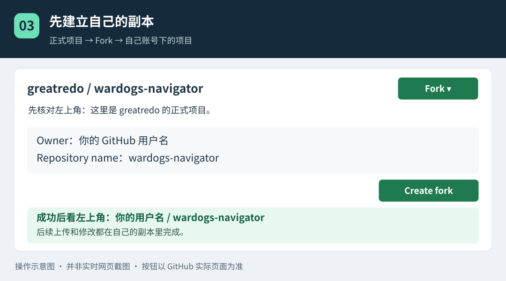
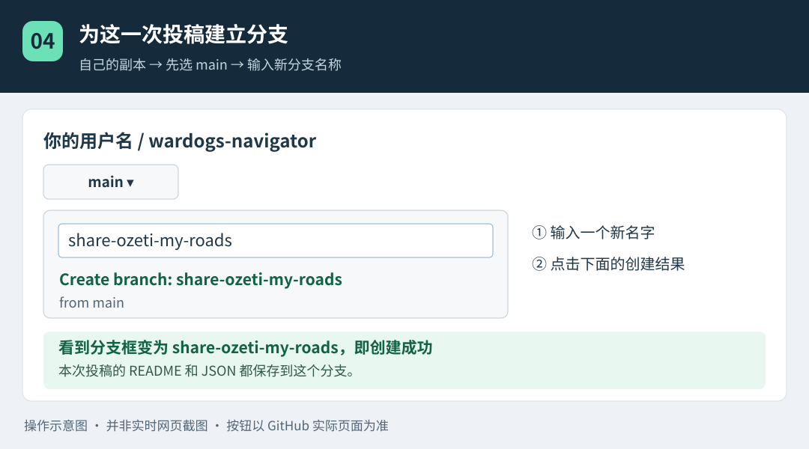
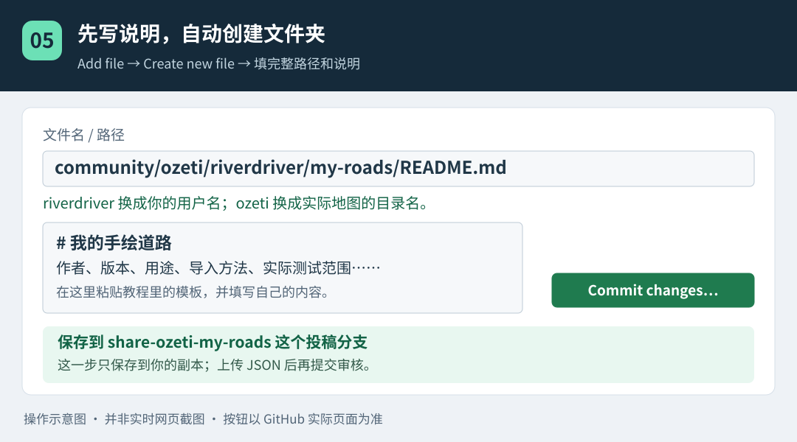
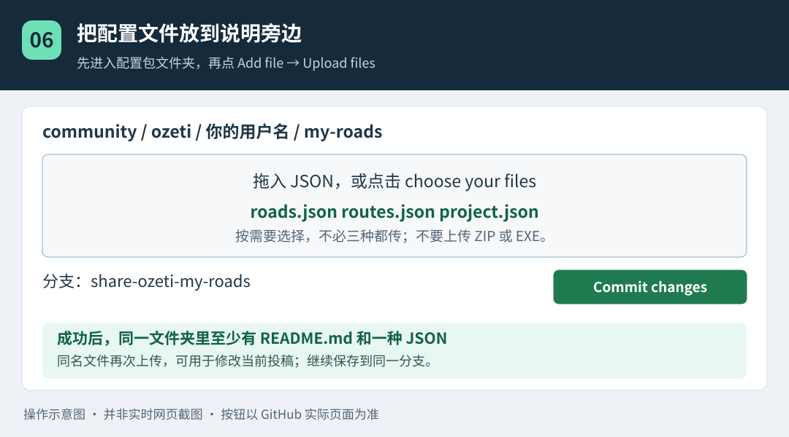
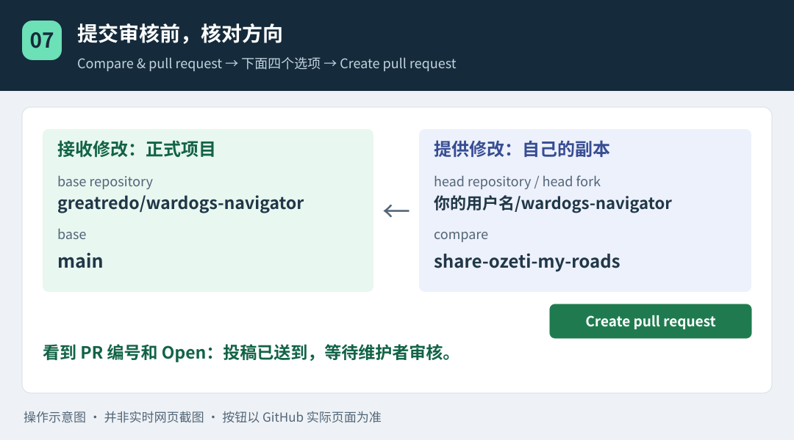
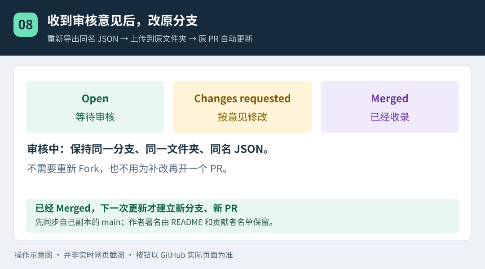

# 玩家配置投稿：从第一次打开 GitHub 开始

这份教程适合从没用过 GitHub、不会编程的玩家。你只需要浏览器、一个 GitHub 账号，以及导航软件导出的文件。**不用安装 Git、Python，不用打开 PowerShell，不用输入命令。**

适用：WARDOGS Navigator 0.5.1。网页按钮可能随 GitHub 更新而变化，下面同时写出英文名称和中文含义。示意图用于找位置，并非实时网页截图；以实际页面为准。手机页面布局不同，建议在电脑上操作。

想用记事本阅读，请下载 [完整纯文字版](新手投稿纯文字教程.txt)。网页版入口：[本教程](https://github.com/greatredo/wardogs-navigator/blob/main/community/新手投稿图文教程.md)。

## 先知道最终要做成什么

你先在自己的账号里准备一份投稿，然后把它交给维护者审核。**提交审核不会直接改动大家使用的项目。** 维护者合并之后，其他玩家才会在正式配置库里看到它。

全程分为：**导出文件 → 建自己的副本 → 上传说明和文件 → 提交审核 → 按意见修改 → 被收录**。

第一次会多出注册和建立副本两步，以后可以重复使用同一个副本。一个地图的一份配置包放在一个文件夹里；不要把不同地图混成一个投稿。

需要认识的几个词：

| 网页上的词 | 把它理解为 |
|---|---|
| Repository / Repo | 项目文件夹，也叫仓库 |
| Fork | 在自己账号下建立一份项目副本 |
| Branch | 这次投稿的草稿分组，也叫分支 |
| Commit changes | 把修改保存到当前分支 |
| Pull request / PR | 请维护者审核并收录这份修改 |
| Merged | 维护者已经合并、收录 |

## 第 1 步：在导航软件里导出文件

1. 打开导航软件，先看窗口标题中的版本号，记下来，后面填写说明用。
2. 在顶部地图框选择你要投稿的地图，例如 **OZETI**。
3. 完成道路或收藏路径的编辑。道路保存后直接使用，不需要勾选“已确认”。若做过游戏内行驶测试，把路段、车辆和方向记下来；没测过就如实写“未实测”。
4. 在电脑桌面新建一个文件夹，取名“导航投稿”。下面导出的文件都放进去，后面容易找到。
5. 按要分享的内容，使用下面对应的按钮。通常分享道路用第一行，分享固定走法用第二行，**不用三种都导出**。

| 想分享的内容 | 在软件里点哪里 | 在保存窗口填写的文件名 |
|---|---|---|
| 道路，包括手画的野地通道及路书 | 左侧“地图标注”→“导出路网” | `roads.json` |
| 完整路线收藏及路书 | 左侧“路线收藏”→“导出收藏” | `routes.json` |
| 整张图的全部配置，包括临时危险区等 | 窗口顶部“导出配置” | `project.json` |

6. 在“另存为”窗口选择刚才的“导航投稿”文件夹，在“文件名”中输入表里的名称，点“保存”。直接在这里输入完整名字，就不用处理 Windows 隐藏扩展名的问题。
7. 打开“导航投稿”文件夹确认文件存在。图标可能因电脑默认软件不同而变化，不影响使用；不必双击打开 JSON，更不要用 Word 另存它。`roads.json.txt` 不是正确的文件名。

注意：导出路网包含当前地图的整套路网，导出收藏包含当前地图的全部收藏；两者都会附带路书，**不是只导出列表里选中的那一条**。在说明中写清包含的内容。完整配置还带目的地、途经点、危险区和道路规则；每局临时标记不适合长期共享时，可先备份，再用第一页的清空按钮整理。

投稿前检查一下：文件属于正确地图；文字备注没有不想公开的内容；不要上传软件 EXE、整个压缩包或本机 `settings.json`。只提交应用导出的 JSON 和下面要写的说明即可。若基于别人的配置修改，需要保留原作者与来源。

## 第 2 步：登录 GitHub

1. 在浏览器地址栏打开 [GitHub](https://github.com/)。
2. 有账号就点 **Sign in（登录）**；没有账号就点 **Sign up（注册）**，按网页提示填写邮箱、密码和用户名，并完成邮箱验证。
3. 记住自己的 **GitHub 用户名**。它不一定等于个人主页显示的昵称。登录后点右上角头像，再点 **Your profile**，个人主页网址最后一段就是用户名。
4. 打开正式项目：[greatredo/wardogs-navigator](https://github.com/greatredo/wardogs-navigator)。后面把这个称为“正式项目”。

这里不需要任何密钥或管理员权限，也不用把密码告诉维护者。

## 第 3 步：建立自己账号下的副本（只需做一次）



1. 确认页面左上方是 **greatredo / wardogs-navigator**。
2. 点右上方 **Fork**。若按钮旁有下拉箭头，选择 **Create a new fork**。
3. 新页面的 **Owner** 选你自己的账号。Repository name 保持 `wardogs-navigator`，其他选项保持默认。
4. 点绿色 **Create fork**，等待网页完成。
5. 成功后，左上方应变成 **你的用户名 / wardogs-navigator**，下方通常写着 `forked from greatredo/wardogs-navigator`。收藏这个页面，后续修改在这里进行。

已经有副本时，不必再 Fork：打开自己的副本，先选择 `main` 分支；若显示落后于正式项目，点 **Sync fork → Update branch** 同步。若提示冲突或要求丢弃自己的修改，先停在该页面，请维护者协助，不要随意点丢弃。

## 第 4 步：给本次投稿建一个分支



1. 确认仍在 **自己的副本** 的 **Code** 页面。
2. 文件列表左上方有一个写着 `main` 的下拉框，点开它。若当前不是 main，先搜索并选中 `main`。
3. 再点这个下拉框，在搜索框输入本次分支名称，例如 `share-ozeti-my-roads`。
4. 在搜索结果中点 **Create branch: share-ozeti-my-roads from main**。有的页面按钮只写 **Create branch**。
5. 文件列表上方的分支名称变成 `share-ozeti-my-roads`，说明成功了。

名称用小写英文字母、数字和短横线即可，不要输入空格。本次投稿之后的所有文件修改都选这个分支。下次新的投稿另建一个，例如 `share-ozeti-my-roads-v2`，不继续用已经合并的旧分支。

## 第 5 步：先创建配置说明，也就建好了文件夹



1. 保持在自己的副本、本次分支，点击文件列表上方 **Add file → Create new file**。
2. 文件名输入框里填一条完整路径。以下示例假设玩家账号是 `riverdriver`，配置名是 `my-roads`：

```text
community/ozeti/riverdriver/my-roads/README.md
```

3. **把 `riverdriver` 改成你自己的 GitHub 用户名**；`my-roads` 可以保留，也可以换成英文配置名。`ozeti` 要与地图一致，三张地图对应如下：

| 软件里的地图 | 路径中使用的名字 |
|---|---|
| OZETI | `ozeti` |
| BAKURANI | `bakurani` |
| ZESTAFONA | `zestafona` |

路径里的 `/` 表示进入下一层文件夹。照着输入即可，不需要提前建文件夹；GitHub 会自动创建。最后一定是 `README.md`，它是给人看的说明。

4. 在下面的大编辑框粘贴以下模板，然后把方括号及里面的提示换成自己的内容。只分享道路时就写 roads.json，没提供的内容不用编造。完整模板另见 [配置说明模板](https://github.com/greatredo/wardogs-navigator/blob/main/community/SUBMISSION_TEMPLATE.md)。

```text
# [给配置取一个中文名字]

地图：[OZETI、BAKURANI、ZESTAFONA 中选一项]
作者：@[自己的 GitHub 用户名]
原作者及来源：[自己整理就写“本人原创”；基于他人修改则填作者和链接]
导航软件版本：[窗口标题中的版本号]
游戏版本：[知道就写，不知道填“未知”]
配置版本：1.0
更新日期：[例如 2026-09-18，改成实际日期]

包含文件：[例如 roads.json]
内容和用途：[补了哪些道路、有哪些路线、在哪些地点使用]
导入方法：[例如：先切到 OZETI，再在“地图标注”点“导入路网”]
收藏导入选项：[没有收藏写“不适用”；有则说明是否贴合、是否建路]

实际测试：[测试路段、车辆、行驶方向和结果；没测过写“未实测”]
已知限制：[没测试的范围、窄桥、坡度等；不清楚写“未知”]
本次修改：首次提交。

许可：我的原创内容按本项目 Apache-2.0 许可证贡献；原有内容保留原作者与许可。
```

5. 检查账号、地图、文件名是否填写正确。点 **Commit changes…（保存修改）**，通常在右上角；部分布局在页面下方。
6. 若出现弹窗，上方 **Commit message** 写“添加 OZETI 道路说明”之类的一句话。下面的 Extended description 可以空着。
7. 若让你选分支，选 **Commit directly to the … branch**，并确认后面的名字是第 4 步创建的分支，**不是 main**。点绿色 **Commit changes** 完成保存。
8. 页面里应能看到这份 README。点击文件上方路径中的 `my-roads`，回到这个配置包文件夹，准备上传 JSON。

此时仅保存到自己的副本，维护者还没收到投稿。接下来上传配置文件，再一起提交审核。

## 第 6 步：上传刚才导出的 JSON



1. 看页面上方：账号是自己、分支是本次投稿分支、路径是 `community / ozeti / 你的用户名 / my-roads`。不要回到项目最外层上传。
2. 点 **Add file → Upload files**。
3. 点 **choose your files**，在弹出的窗口找到桌面的“导航投稿”文件夹，选择 `roads.json` 等要分享的 JSON，点“打开”。也可以把文件拖进网页上传区域。
4. 等待页面显示文件名且上传完成。可选预览图可以一起上传，不是必需。**不要上传 ZIP，也不要上传整套软件。**
5. 页面下方的保存说明写“添加 OZETI 道路配置”。分支仍选第 4 步的同一个分支，点 **Commit changes**。
6. 回到配置文件夹后，至少应该同时看到 **README.md** 和 **一种 JSON**。可以点 JSON 看一眼：通常能看到大括号、map、roads 等文字；不需要读懂或修改它们。

如果看不到 Add file，先回到文件夹列表页；窗口窄时也可能收在菜单中。如果按钮显示 **Propose changes**，先核对页面是不是误进了正式项目；本教程后续以自己的副本和已建分支为准，避免另外创建一份草稿。

## 第 7 步：把投稿交给维护者审核



1. 上传完成后，回到自己副本的首页，保持在本次投稿分支。页面如果显示 **Compare & pull request**，点它。
2. 没有这个按钮时，可以点 **Contribute → Open pull request**。再没有时，打开正式项目的 **Pull requests → New pull request → compare across forks**，使用下面这组选择。
3. 在比较页面顶部核对四个选项，**方向不能反**：

| 选项 | 必须选成 |
|---|---|
| base repository（要接收修改的项目） | `greatredo/wardogs-navigator` |
| base（要接收修改的分支） | `main` |
| head repository / head fork（你的副本） | `你的用户名/wardogs-navigator` |
| compare（你的投稿分支） | 例如 `share-ozeti-my-roads` |

4. 看页面下面的文件改动，应主要是你新建的说明和 JSON。若出现大量不相关程序文件，或内容完全为空，先重新核对上面四项，不要急着提交。
5. 点 **Create pull request**。标题可写“分享 OZETI 手绘补给道路”。在说明框填写：

```text
我提交了哪张地图：OZETI
配置位置：community/ozeti/我的用户名/my-roads
主要内容：……
导航软件版本：……
是否测试过：……
希望维护者重点检查：……（没有就写“无”）
```

6. 再点绿色 **Create pull request** 提交。如果有 **Create draft pull request** 选项，正式准备好投稿时选择普通的 Create pull request。
7. 成功后页面标题旁会有一个编号，例如 `#2`，并显示 **Open**。保存该网页地址，这就是你的投稿审核页面。

到这里，投稿已经送到了。**你不需要点击 Merge 或 Squash and merge，合并由维护者操作。** 也不用重复上传、申请写权限或发送账号密码。

## 第 8 步：审核时怎么补改



审核意见可能出现在 PR 的 **Conversation** 或 **Files changed** 中，GitHub 也可能发邮件通知。维护者没有回复时，Open 只是“还在等待”，不表示失败。

如果需要调整道路或路线：

1. 在导航软件里修正，重新用同一种按钮导出到“导航投稿”文件夹，仍用原文件名，例如 `roads.json`。
2. 打开**自己的副本**，用分支下拉框选回本次投稿分支。
3. 进入原配置文件夹，再点 **Add file → Upload files**，上传新导出的同名文件。这次会更新该路径的文件。
4. 保存说明写清修了什么，例如“修正北侧桥头连接”，保存到当前投稿分支。
5. 需要补充文字时，点 README.md，再点铅笔 **Edit this file**，修改测试范围、配置版本和变更说明，再 **Commit changes** 到同一分支。
6. 回到原 PR 刷新，新增提交会自动出现。在评论框简单告诉维护者“已修正桥头连接，请再次检查”。

**同一次投稿还没合并时，只修改原分支，不用再创建第二个 PR。** 若只是维护者提出问题，可以先直接在 PR 评论框回复，不需要动文件。

状态含义：绿色 **Open** 是待审核；**Changes requested** 是需要修改；紫色 **Merged** 才是已收录；红色 **Closed** 且没有 Merged 通常表示关闭但未收录，可查看关闭原因。

合并后，配置会出现在正式项目；维护者会在地图索引和社区贡献者名单中保留作者及配置链接。GitHub 自带贡献者统计可能延迟或受统计条件影响，配置包 README 的作者署名会保留。贡献者身份不等于仓库写权限。

## 第 9 步：以后更新已经被收录的配置

1. 先打开自己的副本，分支选择 **main**。
2. 点 **Sync fork → Update branch**，把正式项目已经合并的内容同步过来；如果提示已经最新，就继续。发生冲突时请维护者协助。
3. 从 main 新建一个分支，例如 `update-ozeti-my-roads-v2`。不要复用旧的已合并分支。
4. 打开原来的配置文件夹，上传新导出的**同名** JSON，保留原目录。
5. 编辑 README，把配置版本从 1.0 改为 1.1，更新日期，写清新增或修复内容、实际测试范围。程序版本按实际使用的版本填写。
6. 两项都保存到新分支，再按第 7 步创建**新的 PR**。

一句话区分：**还在审核中，改原分支、原 PR 自动更新；已经合并完，下次用新分支、新 PR。**

## 第 10 步：修改别人分享的配置

先下载对方的 JSON，在软件里导入、修改，再导出。如果是修复原配置中的错误，通常更新**原来的配置包路径**，按第 9 步提交 PR；README 保留原作者，把自己列为本次修改者，并写清改了哪里。

如果是不同风格或用途的另一套走法，可以在**自己用户名的目录下另建配置包**，说明基于哪一份配置、附来源链接、保留作者与许可证。不要把别人的内容改名后写成“本人原创”。方向拿不准时可先在正式项目的 Issues 页面说明想改什么。

整个过程中，你仍在自己副本的分支里改文件；不会直接覆盖其他人的正式配置。

## 其他玩家怎样下载和使用

1. 打开 [社区配置库](https://github.com/greatredo/wardogs-navigator/tree/main/community)，按地图找到配置包，先读 README 中的适用版本、内容和限制。
2. 点开需要的 JSON，点文件右上方 **Download raw file** 下载原始文件；也可以点 **Raw** 后按 Ctrl+S 保存，文件名保留 `.json`。不要把 GitHub 网页“另存为 HTML”，也不需要用绿色 Code 按钮下载整个项目。
3. 在导航软件顶部点 **导出配置**，先给自己的当前地图保存一份备份。这里的“备份”留在自己电脑，不需要上传。
4. 按下载文件的说明，使用对应导入入口：路网是“地图标注 → 导入路网”，收藏是“路线收藏 → 导入收藏”；两种都先切到正确地图。整套配置是顶部“导入配置”，会替换文件所属地图的内容并自动切图。
5. 导入收藏时，想保留作者原走法就**不重新贴合**；不希望缺路部分成为普通规划也会使用的道路，就选择**不建立道路**。这样仍能导航该收藏。勾选贴合会按你当前的道路重新计算，走法可能变化。
6. 导入后检查道路、路线起终点和道路规则。含野地的路线需要允许野地；危险区仍会影响规划。

路网和收藏是合并导入。导入同一配置的更新版时，内容不同的旧、新道路可能同时保留，**不等于自动完整覆盖旧版**；发现重复时先核对再删除。想整套替换可用作者提供的完整配置，但务必先备份。发生错误时可立即点“撤销”，也可导入自己的完整备份恢复。

配置被合并后，其他玩家可以马上下载 JSON；不用等新的软件 EXE 发布，但要满足配置说明中的软件版本要求。已经下载过的玩家需要自行重新下载和导入，不会自动更新。

## 常见卡点

- **找不到自己的副本：** 点右上角头像 → Your repositories，找自己的 wardogs-navigator；不要误进 greatredo 名下的正式项目。
- **找不到 Add file / 铅笔：** 先确认已登录、当前是自己的副本；上传要在文件夹页，铅笔要先打开文件。窄窗口可能把按钮放进菜单中。
- **路径写错或传错文件夹：** 还没提交审核时，可以在自己分支里打开文件，用编辑文件名/移动功能修正完整路径；不熟悉就把页面地址发在自己的 PR 中，请维护者指出应移动的位置，不要删除整个副本重来。
- **只有 README，没有 JSON：** 回到第 6 步。说明文件本身不能被导航软件导入。
- **“没有差异 / There isn't anything to compare”：** 核对 compare 是否选了投稿分支，以及文件是否真的保存到了那个分支；也可能这份修改已经合并过了。
- **上传文件太大：** 检查是否误选了软件 ZIP、EXE 或整套图片。程序接受的单份 JSON 上限为 15,000,000 字节，网页单文件上传另有 25 MiB 限制；不要靠改扩展名绕过。
- **导入提示地图不一致：** 路网和收藏需要先切换到文件所属地图；不能靠改文件名把 OZETI 坐标变成另一张地图。
- **导入提示格式错误：** 重新从软件导出，或重新下载 Raw 文件；不要使用网页 HTML、Word 文档或手动删减字段的 JSON。
- **不会解决审核里的技术问题：** 直接在原 PR 回复遇到的步骤和报错，维护者可以协助；无需为了投稿学习编程。

遇到问题可在 [项目 Issues](https://github.com/greatredo/wardogs-navigator/issues) 中点 New issue，写明“我做到第几步、点了什么、页面显示什么”，附上相关页面链接。不要在截图或评论里放账号密码。

## GitHub 官方参考

网页流程依据 GitHub 的 [从 Fork 创建 PR](https://docs.github.com/en/pull-requests/how-tos/create-pull-requests/creating-a-pull-request-from-a-fork)、[上传文件](https://docs.github.com/en/repositories/working-with-files/managing-files/adding-a-file-to-a-repository) 和 [同步 Fork](https://docs.github.com/en/pull-requests/how-tos/work-with-forks/syncing-a-fork) 说明整理。这里的操作示意图由本项目绘制，按钮位置可能因网页更新而调整。
